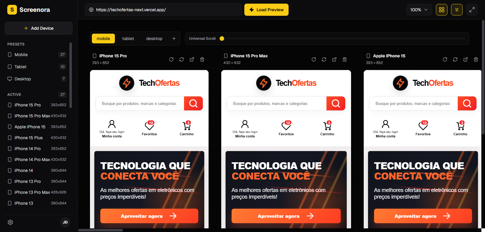

# Screenora 📱💻📺

<p align="center">
  
</p>

<p align="center">
  <a href="README.pt.md">Leia em Português</a>
</p>

**Screenora** is an advanced responsive viewing tool that allows you to test your websites and applications on multiple simulated devices simultaneously. Ideal for developers and designers who need to ensure visual quality on any screen.

---

## ✨ Key Features

- 🔄 Simultaneous Viewing: Test layouts in Mobile, Tablet, and Desktop resolutions side-by-side.
- 📜 Universal Scroll: Scroll on one device and all others will scroll in sync.
- 🧩 Dedicated Extension: Removes iframe blocking headers to load any URL.
- 🎨 Premium Interface: Dark, modern design focused on user experience.

---

## 🛠️ How to Run the Application

This is a project developed with [Next.js](https://nextjs.org/).

### Step 1: Install dependencies
In the terminal, at the root of the project, run:
```bash
npm install
```

### Step 2: Start the development server
```bash
npm run dev
```

### Step 3: Access in the browser
Open [http://localhost:3000](http://localhost:3000) to see Screenora in action.

---

## 🔌 How to Install the Extension (Required to load external sites)

For Screenora to be able to load sites that block `iframes`, install the extension located in the `extension Screenora` folder:

1. Open Google Chrome.
2. Go to `chrome://extensions/` (or go to Menu > More Tools > Extensions).
3. Enable **"Developer mode"** in the top right corner.
4. Click **"Load unpacked"** in the top left corner.
5. Select the `extension Screenora` folder inside this project.
6. Ready! Now you can test any URL in Screenora.

---

## 📄 License

This project is under the **MIT** license. Feel free to use, modify, and distribute.
